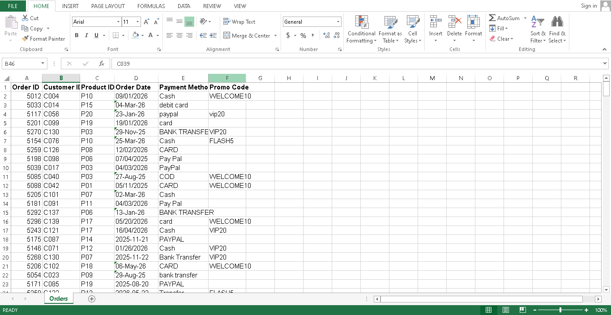
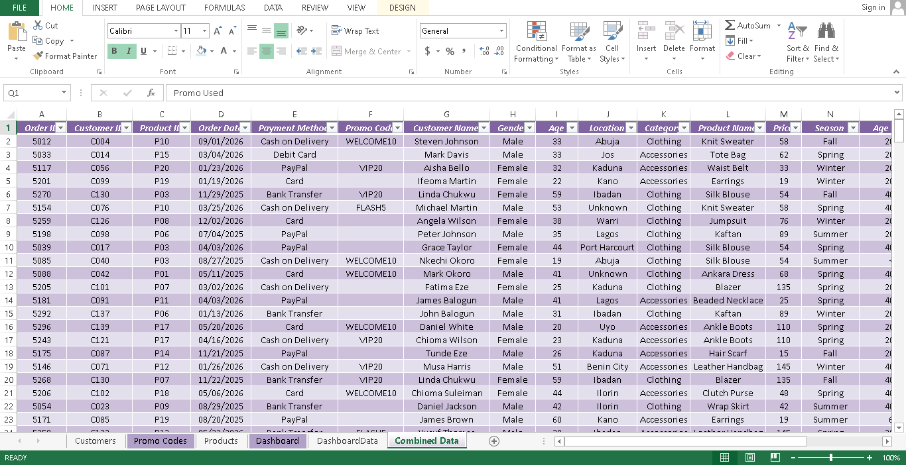
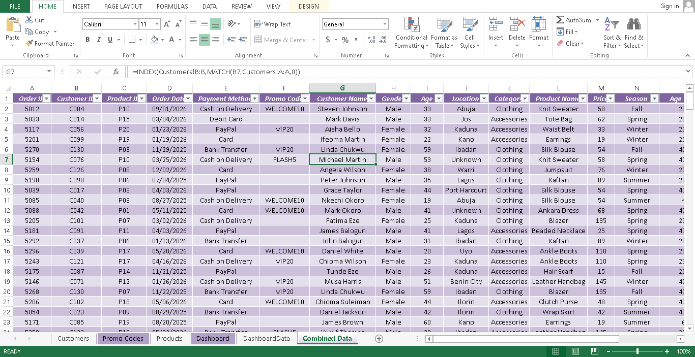
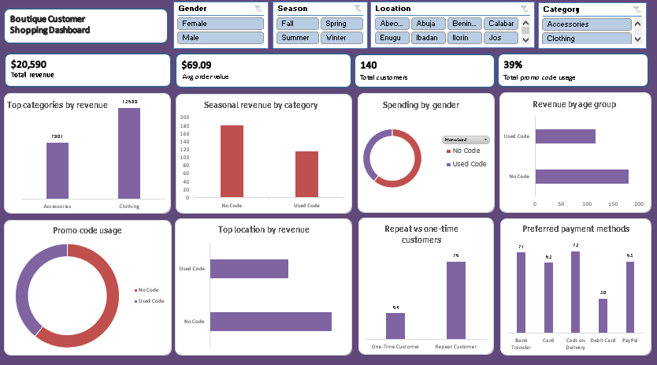
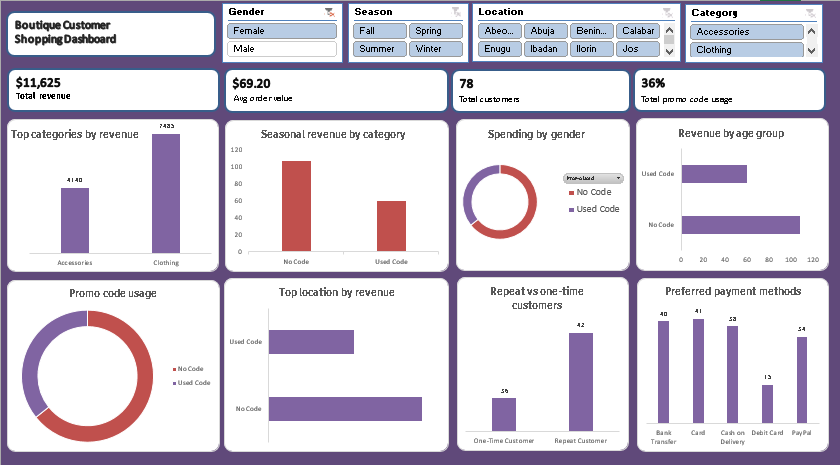

# Boutique Customer Shopping Dashboard (Excel)

A standalone Excel project built to simulate a real freelance client engagement: a small online boutique owner needed her messy customer order data cleaned, joined, and turned into a dashboard she could actually understand and use.

Unlike the other projects in this portfolio, this one uses no SQL and no Power BI. Everything, from the raw messy source files to the final interactive dashboard, lives inside Excel.

---

## The Client Brief

> **Subject: Help me understand my customers better**
>
> Hi! I run a small online boutique (clothing and accessories, mostly). I've been collecting customer order data through my store for a while now, things like what they bought, when, how they paid, where they're from, that kind of thing, but it's all just sitting in a spreadsheet and honestly a bit messy. Some entries are duplicated, some fields are blank, and I don't really know what to do with it.
>
> I really want to understand who my customers actually are. Are more men or women buying? What age groups spend the most? What's selling best each season? Where are most of my customers located? Do people prefer certain payment methods? And how many of my customers keep coming back versus buy once and disappear?
>
> I don't need anything super technical, I just want something I can open, click around in, and actually understand my business better. Thanks so much!

## Clarifying Questions

Before touching the data, I identified what was still unclear about the brief and what I'd need to know to scope the work properly:

1. **How many orders or customers are we talking about, and over what time period?** This determines whether meaningful seasonal trends are even possible to show.
2. **Are the blank/duplicate fields consistent (always the same columns) or random?** This shapes how the data should be treated during cleaning.
3. **Is the product range limited to clothing and accessories, or is there more?** This locks down what the Category field should actually contain.

## What I Built

The client's data arrived as four separate messy Excel exports:

- **Orders** — the transaction log (Order ID, Customer ID, Product ID, Order Date, Payment Method, Promo Code)
- **Customers** — customer details (Customer ID, Name, Gender, Age, Location)
- **Products** — a lookup table (Product ID, Category, Product Name, Price)
- **Promo Codes** — a small lookup table (Promo Code, Discount)

None of these files could answer the client's questions on their own. Orders had no names, no product details, and no prices, just IDs. The real work was cleaning each source sheet and then joining them into one usable table.

**Cleaning included:**
- Standardizing inconsistent text casing (gender, payment methods, customer names)
- Trimming stray whitespace from names and IDs
- Parsing four different date formats into consistent real dates
- Filling blank Age values with the dataset average, and blank Location values as "Unknown"
- Removing exact duplicate rows and fully blank junk rows

Most of this was done manually using Excel formulas (`PROPER`, `TRIM`, `DATEVALUE`, `IF`, `COUNTBLANK`). The Orders table's date and payment cleaning was finished with a scripted pass using the same rules, since a repetitive fix across hundreds of rows is exactly the kind of task a working analyst automates rather than doing by hand.

**Joining the data:** I used `INDEX/MATCH` (rather than `VLOOKUP`, which I already used in an earlier project) to pull Customer Name, Gender, Age, and Location from the Customers sheet, and Category, Product Name, and Price from the Products sheet, into a single combined table (`tblCombined`) using Customer ID and Product ID as the match keys.

**Helper columns added** to support the analysis: Season (derived from Order Date), Age Group, and Repeat Customer status.

**Building the dashboard:** 9 PivotTables (built on the Data Model to support Distinct Count) feed 9 PivotCharts and 4 slicers (Gender, Season, Category, Location), all cross-connected so any filter updates every chart and KPI card at once. The 4 KPI cards are formula-linked to live PivotTable results, not typed-in numbers, so they update in real time along with the charts.

## Dashboard Questions Answered

The dashboard was designed around the client's actual questions, one visual per question:

1. What's my total revenue, and how many customers do I have overall? *(KPI cards)*
2. What's my average order value? *(KPI card)*
3. Are more men or women buying? *(donut chart)*
4. Which age group spends the most? *(bar chart)*
5. What sells best each season? *(grouped bar chart)*
6. Where are my customers located? *(bar chart, top locations)*
7. What payment methods do people prefer? *(bar chart)*
8. How many customers are repeat buyers vs. one-time? *(bar chart)*
9. What percentage of orders use a promo code? *(donut chart)*

## Tools & Skills Used

- Excel formulas: `INDEX`/`MATCH`, `TRIM`, `PROPER`, `DATEVALUE`, `TEXT`, `COUNTIF`, `COUNTBLANK`, `IF`
- PivotTables with the Data Model (for Distinct Count)
- PivotCharts (column, bar, and doughnut)
- Slicers with shared Report Connections across multiple PivotTables
- Formula-linked KPI cards for live-updating dashboard summaries
- Data cleaning: standardizing text casing, parsing mixed date formats, deduplication, handling blanks

## Screenshots

**Before cleaning** — raw Orders data with mixed date formats and inconsistent casing

**After cleaning and joining** — the combined table with all fields populated

**The lookup in action** — an INDEX/MATCH formula pulling customer data into Combined Data

**Final dashboard, default view**

**Final dashboard, filtered by Gender = Female** — KPI cards and charts update live

## A Note on Process

This project was built to mirror a real freelance engagement from start to finish: interpreting a vague client ask, scoping it with clarifying questions, cleaning genuinely messy multi-source data, and delivering a single self-contained workbook the client could open and use without any technical knowledge. Where a cleaning step was repetitive across a large dataset, I used a scripted pass rather than fixing hundreds of rows by hand, the same judgment call a working analyst makes on real client work.
